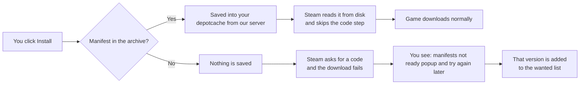
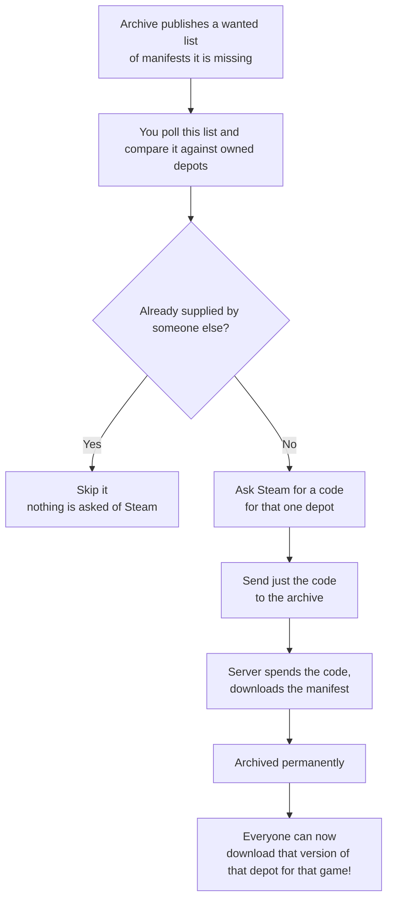

# MRC System

**MRC** stands for **Manifest Request Code** - a short-lived token Steam hands out that lets you download a specific manifest file for a depotid.


BetterSteamTools keeps a shared archive of Steam **depot manifests**. If a game you want is already in that archive, it downloads normally. If it isn't, someone who owns that game can contribute it - automatically, in the background, without sharing anything about their library.

This page explains what that means for you, what your PC actually sends, and how to turn it off.

## Why downloads need this at all

To download a depot, Steam wants an MRC. Three things about it matter:

- It's tied to **one exact depot and one exact version**
- It **expires within about 5 minutes**.
- Only an account that **actually owns the game** can generate one (following the exploit getting patched).

**But there's a shortcut.** If the manifest file is already sitting in your `<Steam>/depotcache` folder, Steam just reads it from disk and **never asks for a code at all**. That's the whole idea: put the manifest there first, and the download works like any normal game.

## When you download a game

Before Steam gets a chance to ask for a code, BetterSteamTools tries to fetch the manifest from the archive and drop it into `depotcache`.



:::tip "manifests not ready" is not a broken install
It means that exact version isn't in the archive yet. It's now on the list for donors to supply - try again later!
:::

## When you donate

This is the other half, and it only involves games **you already own**.



Steam tells the client what depot it owns so no extra requests are needed.
You also donate for free just by playing: when you download a game you own normally, Steam mints a code as part of that download, and BetterSteamTools passes it along. That costs no extra requests!

## What leaves your PC — and what doesn't

**What gets sent to LuaTools servers anonymously:**

- Depot and manifest IDs that were **already on the wanted list** *and* that you own.
- The short-lived MRC for those.
 This code is the same for everyone so this does not identify you. Thank you steam!


A few more things worth knowing:

- **Nothing extra is asked of Steam to work out what you own.** That comes from the license list Steam already sends client PC when you sign in. It's read as it arrives. 
- **Codes are never stored.** They're used immediately and thrown away. They'd be worthless within minutes anyway.
- **The manifest itself isn't private.** It's a file listing that Steam's own CDN hands to anyone holding a valid code. A manifest CANNOT change (for that specific manifest id anyway, depots can have new "latest" manifests.)
## Turning it off

Add this to `opensteamtool.toml` in your Steam folder (please consider not though, help out the community and don't be a leech!):

```toml
[donate]
enabled = false
```

