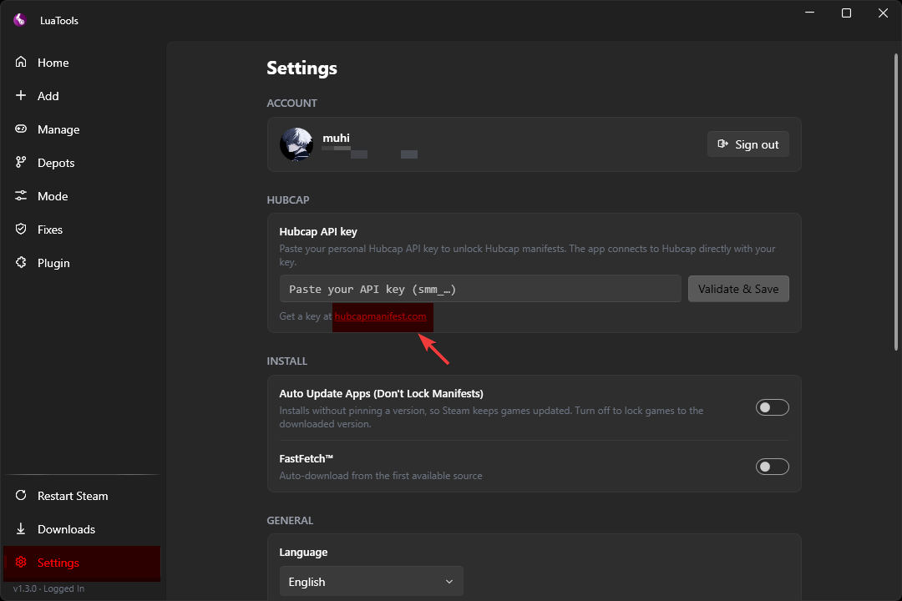

# Hubcap API

Hubcap is optional since Luie is back!

Step 1: First, join the [HubcapManifest](discord.gg/hubcapsmanifest) discord server and verify your account.

Step 2: Click the link shown in the first image and sign up there as well.

Step 3: You should see API in the top right corner of the page. Click Generate Key and enter it into your Luatools app.

Keys are valid only for 7 days after that, you will need to add a new one. 

